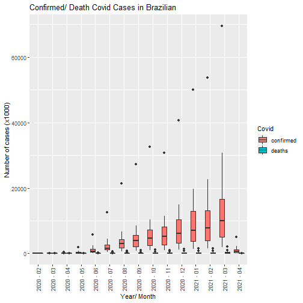
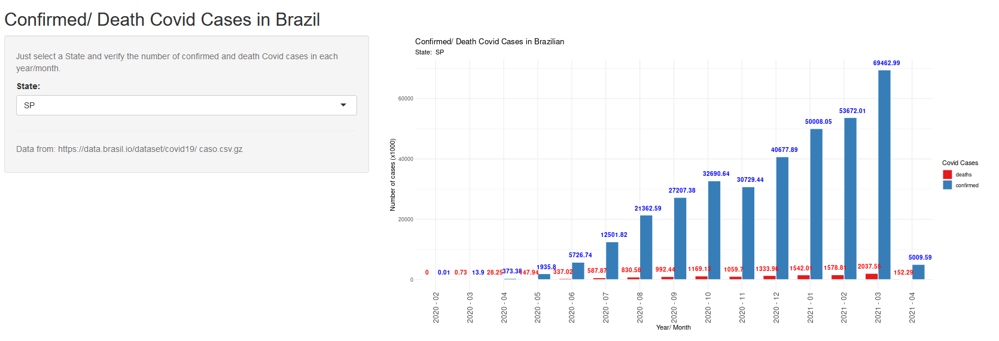

Reproducible Pitch Presentation 
========================================================
COVID Cases in Brazil <br>
*(from 03-2020  to  2021-04)*

<hr>
Author: Renata Guanaes <br><br>
Date: 04/04/2021


Confirmed/ Death Covid Cases in Brazil
========================================================
transition: rotate
<font size = "5">This Application shows the plot containing the number of confirmed (blue bars) and death (red bars) Covid cases in each State of Brazil, for each year/month, since 2020-03 until 2021-04. Just select a State, visualize covid case numbers and note its increasing growth over the months. 
<br>
Data are collected from  https://data.brasil.io/dataset/covid19/caso.csv.gz

<hr>

Resources:
- RStudio and Shiny UI Server Application
- GGPlot 
- User Input (State chosen) resulting in different outputs (interactivity) 

<hr>

Github Repository Link: https://github.com/tatuchag/DevelopDataProducts 
</font>


Summary of Dataset
========================================================
transition: rotate


<font size = "5">

```r
setwd("~/data")
# Preparing Data
data <- read.csv(file = "caso.csv", header = TRUE, encoding = "UTF-8", sep = ",")
data <- data %>% filter(place_type=='state')
data <- data[, c(1,2,5,6)] 
colnames(data) <- c('Date','State', 'confirmed', 'deaths')
data$Date <- as.Date(data$Date, format = '%Y-%m-%d')
summary(data)
```

```
      Date               State             confirmed           deaths       
 Min.   :2020-02-25   Length:10311       Min.   :      0   Min.   :    0.0  
 1st Qu.:2020-06-18   Class :character   1st Qu.:  22952   1st Qu.:  575.5  
 Median :2020-09-22   Mode  :character   Median :  95142   Median : 2400.0  
 Mean   :2020-09-22                      Mean   : 175109   Mean   : 4794.2  
 3rd Qu.:2020-12-27                      3rd Qu.: 218826   3rd Qu.: 5682.0  
 Max.   :2021-04-02                      Max.   :2513178   Max.   :76552.0  
```
</font>

In Brazil, there are 27 States.
<font size = "5">

```r
table(data[,"State"])
```

```

 AC  AL  AM  AP  BA  CE  DF  ES  GO  MA  MG  MS  MT  PA  PB  PE  PI  PR  RJ  RN 
382 388 381 375 391 381 391 393 387 379 389 384 376 381 387 387 380 385 384 343 
 RO  RR  RS  SC  SE  SP  TO 
370 375 385 387 374 396 380 
```
</font>


Boxplots 
========================================================
transition: rotate

<font size = "5">

</font>


Shiny App
========================================================
<font size="5">Link: https://renatabdf.shinyapps.io/shinyapp/</font> 




